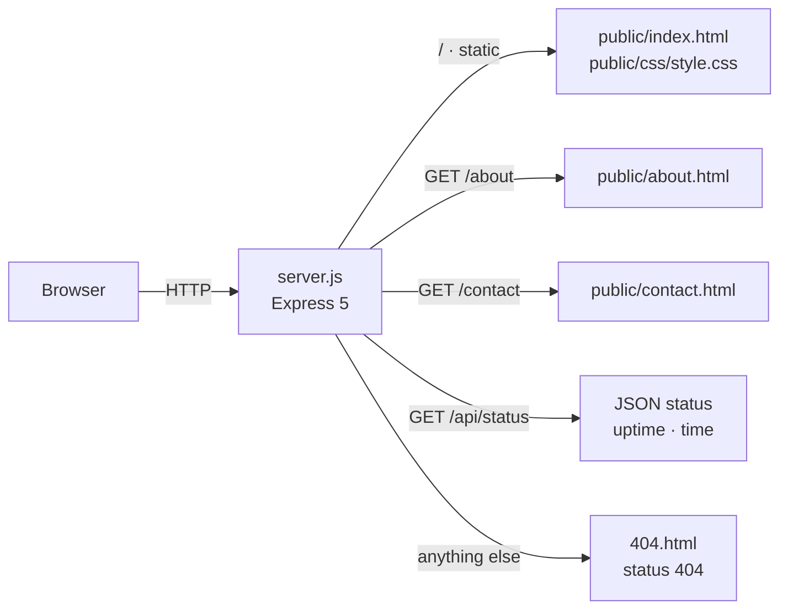
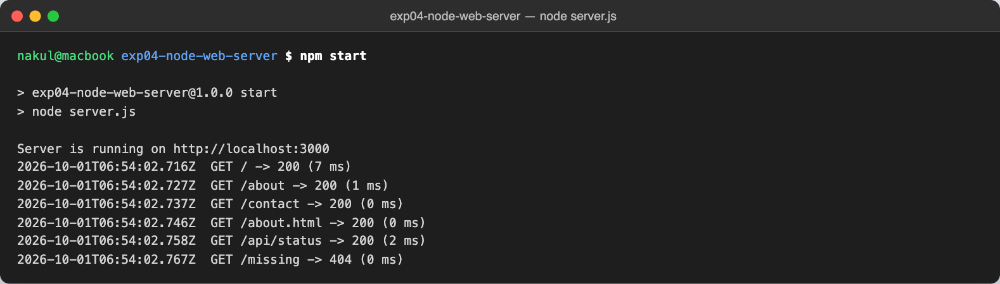
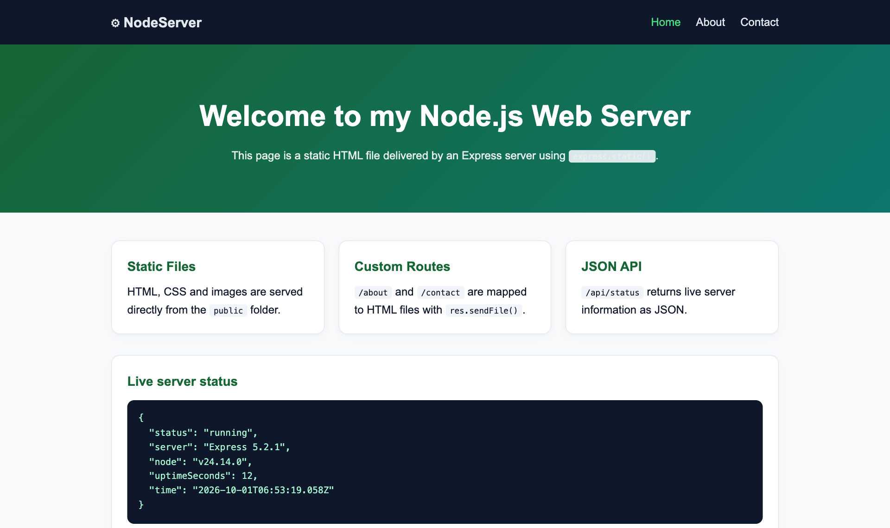
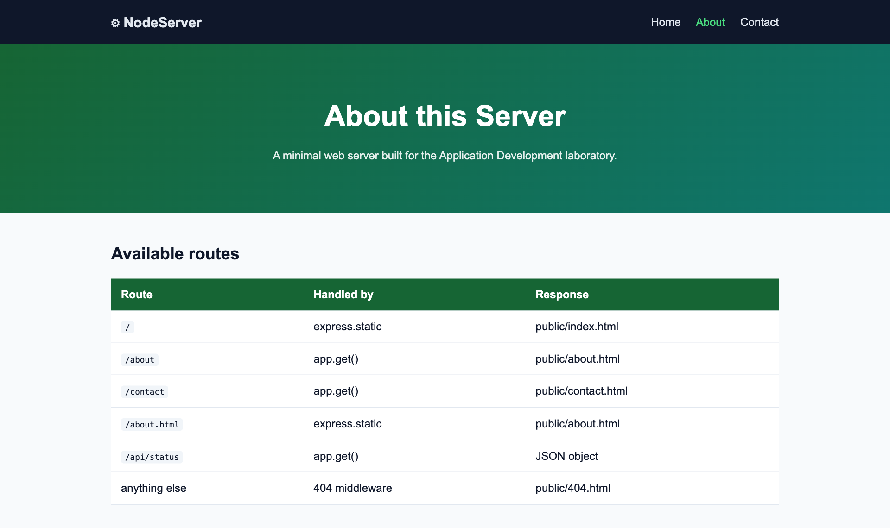
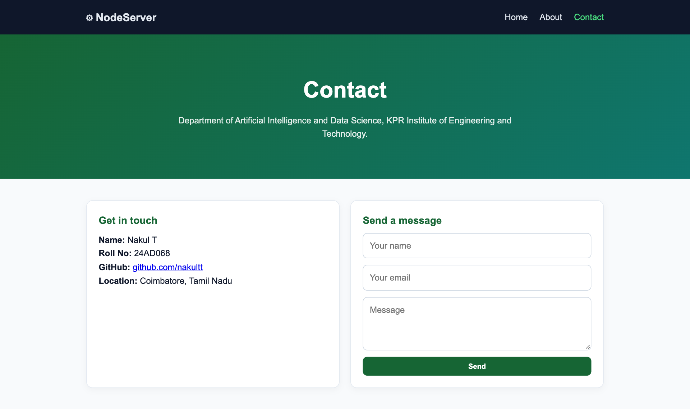
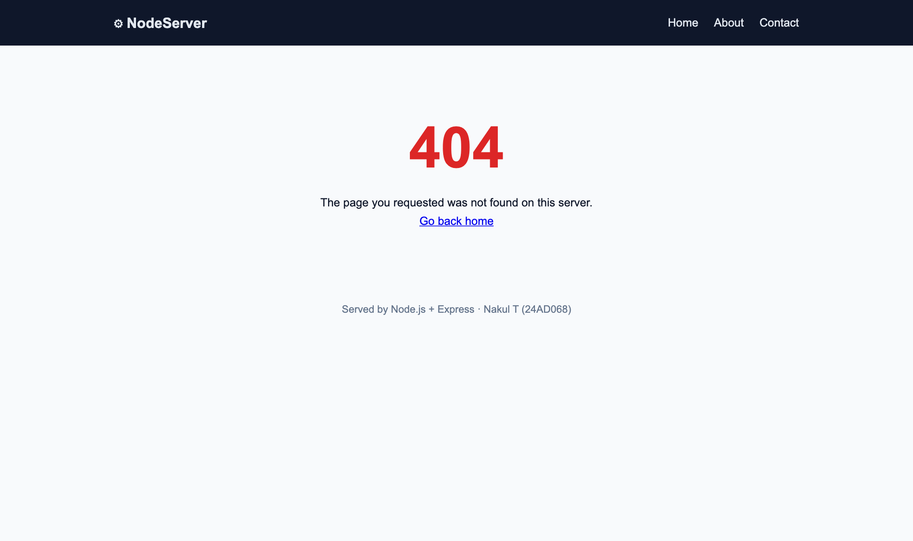
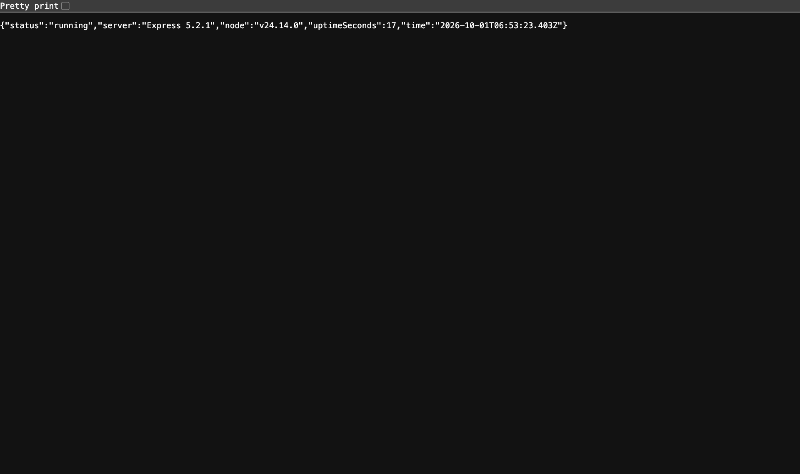
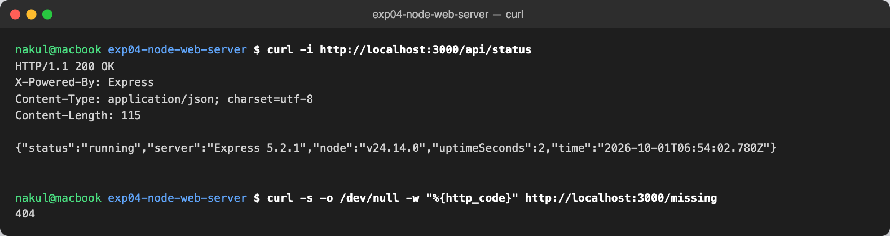

# Basic Web Server with Node.js

> **Application Development Laboratory (U21AD502) — Experiment 04**
> Prepared by **Nakul T (24AD068)**, Department of Artificial Intelligence and Data Science, KPR Institute of Engineering and Technology.

## Project Overview

A basic web server built with Node.js and Express that delivers static HTML pages (Home, About, Contact and a custom 404 page) from a public folder. It also defines clean routes without the .html extension, a request-logging middleware and a small JSON status endpoint.

**Aim:** To develop a basic Node.js server to deliver static HTML pages.

## Features

- Serves static HTML, CSS and other assets from the public/ directory using express.static()
- Clean routes /about and /contact mapped to HTML files with res.sendFile()
- JSON endpoint /api/status reporting Express version, Node version and uptime
- Custom request-logging middleware (method, URL, status code, response time)
- Custom 404 page for unknown routes
- Port configurable with the PORT environment variable (default 3000)

## Tech Stack

| Layer | Technology |
|---|---|
| Runtime | Node.js |
| Framework | Express 5 |
| Front end | HTML5, CSS3 |
| Tools | npm, curl, Google Chrome |

## Architecture



The server serves the `public/` folder as static files, adds explicit routes for the clean URLs `/about` and `/contact`, exposes a small JSON status endpoint, and falls back to a custom 404 page.

## Folder Structure

```
exp04-node-web-server/
├── .gitignore
├── LICENSE
├── README.md
├── package.json
├── public/
│   ├── 404.html
│   ├── about.html
│   ├── contact.html
│   ├── css/
│   │   └── style.css
│   └── index.html
├── screenshots/   (output screenshots)
└── server.js
```

## Setup and Installation

1. Install Node.js 18 or later.
2. Clone the repository: `git clone https://github.com/nakultt/exp04-node-web-server.git`
3. Open the folder: `cd exp04-node-web-server`
4. Install dependencies: `npm install`

## How to Run

```bash
npm start
```

Open <http://localhost:3000>, <http://localhost:3000/about>, <http://localhost:3000/contact> and <http://localhost:3000/api/status>. Use `PORT=8080 npm start` to run on another port.

## Screenshots

### 1. Server started with npm start, showing request log



### 2. Home page (index.html) served by express.static()



### 3. About page served through the /about route



### 4. Contact page served through the /contact route



### 5. Custom 404 page for an unknown route



### 6. JSON response from /api/status



### 7. Testing the server from the terminal with curl



## Result

The project was successfully developed and executed, and the output was verified.

## Author

**Nakul T** — 24AD068 · B.Tech Artificial Intelligence and Data Science · [github.com/nakultt](https://github.com/nakultt)
